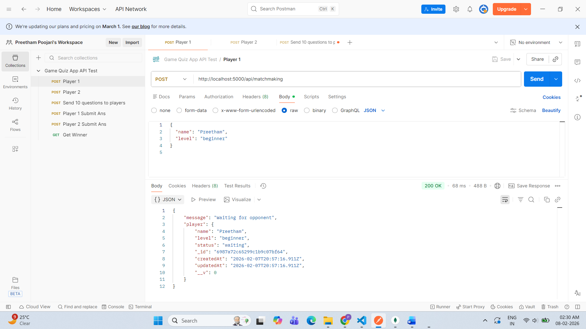
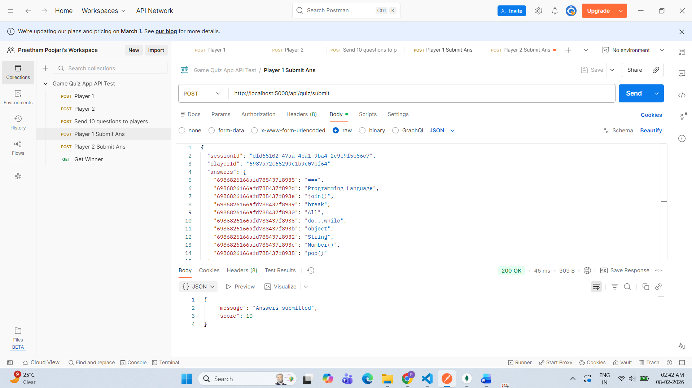
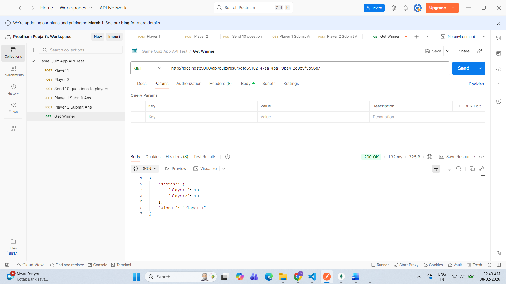

# 🎮 Multiplayer Quiz Game API

A backend system for a real-time multiplayer quiz game built using **Node.js**, **Express**, and **MongoDB Atlas**.

This API allows two players to join a quiz session, answer questions, and determine a winner based on scoring and submission time.

---

## 🚀 Features

✅ Player matchmaking  
✅ Random quiz question generation  
✅ Same question order for both players  
✅ Answer submission validation  
✅ Score calculation  
✅ Winner determination  
✅ Tie-breaker using submission time  
✅ Duplicate answer prevention  
✅ Cloud database using MongoDB Atlas  

---

## 🏗️ Tech Stack

- Node.js
- Express.js
- MongoDB Atlas
- Mongoose
- Postman (API Testing)

---

## 📂 Project Structure

```
src/
 ├── config/
 ├── controllers/
 ├── models/
 ├── routes/
 ├── utils/
 └── app.js
server.js
```

---

## ⚙️ Setup Instructions

### 1️⃣ Clone Repository

git clone https://github.com/Preethampoojari/game-matching-quiz-api.git

cd game-matching-quiz-api


---

### 2️⃣ Install Dependencies

npm install


---

### 3️⃣ Setup Environment Variables

Create `.env` file:

PORT=5000

MONGO_URI=your_mongodb_connection_string


---

### 4️⃣ Run Server

npm run dev


Server runs on: http://localhost:5000


---

## 📌 API Endpoints

### 🎯 Player Matchmaking
POST `/api/matchmaking`

Creates or matches players into a quiz session.

---

### 🎯 Send Quiz Questions
POST `/api/quiz/start`

Generates quiz session and assigns questions.

---

### 🎯 Submit Answers
POST `/api/quiz/submit`

Submit answers for player.

---

### 🎯 Get Result
GET `/api/quiz/result/:sessionId`

Returns final scores and winner.

---

## 🧠 Winner Logic

Winner is decided based on:

1️⃣ Highest correct answers  
2️⃣ If equal → Player who submitted answers first  
3️⃣ If both equal → Draw  

---

## 🛡️ Validations Implemented

- Duplicate answer submission blocked  
- Both players must submit answers before result  
- Invalid player protection  

---

## 📮 Postman Collection

You can test all APIs using the Postman collection below:

👉 [Download Postman Collection](./game-quiz-api.postman_collection.json)

### How to Use
1. Import this JSON file into Postman
2. Run APIs in the following order:

   - Player Matchmaking
   - Start Quiz Session
   - Submit Player Answers
   - Get Result

---

## 📝 Important Notes For API Usage

---

### 🎯 Matchmaking (`POST /api/matchmaking`)

Used to register a player and find opponent.

#### Request Body
```json
{
  "name": "Player Name",
  "level": "beginner | intermediate | advanced"
}
```

👉 First player will be placed in waiting state
👉 Second player will automatically create a quiz session


## 🎯 Start Quiz (POST /api/quiz/start)

Used to generate quiz questions for both players.

Request Body

```json
{
  "sessionId": "quiz_session_id"
}
```

👉 This endpoint:

Generates random questions

Assigns same question set to both players

Starts the quiz session


## 🎯 Submit Answers (POST /api/quiz/submit)

Used by each player to submit quiz answers.

Request Body

```json
{
  "sessionId": "quiz_session_id",
  "playerId": "player_id",
  "answers": {
    "questionId": "selected_option"
  }
}
```

✅ Answers Object Format

answers must be an object

Key = Question ID

Value = Selected Answer

Example
```json
{
  "answers": {
    "6986826166afd788437f8935": "===",
    "6986826166afd788437f8932": "Programming Language"
  }
}
```

👉 Important Rules:

Player can submit answers only once

Duplicate submission is blocked

Answers must match valid question IDs


## 🎯 Get Quiz Result (GET /api/quiz/result/:sessionId)

Returns final score and winner.

Both players must submit answers before result is available.

Example

```
GET /api/quiz/result/SESSION_ID
```

## 🧠 Winner Logic

Winner is decided based on:

- 1️⃣ Highest correct answers
- 2️⃣ If tie → Player who submitted answers first
- 3️⃣ If both equal → Match Draw


## ⚠️ General Testing Flow

Always follow this order while testing APIs:

1. POST /api/matchmaking → Player 1
2. POST /api/matchmaking → Player 2
3. POST /api/quiz/start → sessionId required
4. POST /api/quiz/submit → Player 1
5. POST /api/quiz/submit → Player 2
6. GET /api/quiz/result/:sessionId


---


## 🌐 Deployment

Backend deployed using **Render**

Live API:
👉 https://game-matching-quiz-api.onrender.com

Note:
Free Render instance may take 30-50 seconds to wake up after inactivity.

---


## 🧪 API Testing Proof (Postman)

## - 🎯 Player Matchmaking — Player 1 (Waiting State)




## - 🎯 Player Matchmaking — Player 2 (Match Found)


## - 🎯 Sending Quiz Questions to Players


## - 🎯 Player 1 Answer Submission




## - 🎯 Player 2 Answer Submission


## - 🚫 Duplicate Submission Prevention


## - 🏆 Winner Determination




---


## 👨‍💻 Author

Preetham Poojari  
Full Stack Developer (MERN / Next.js)

